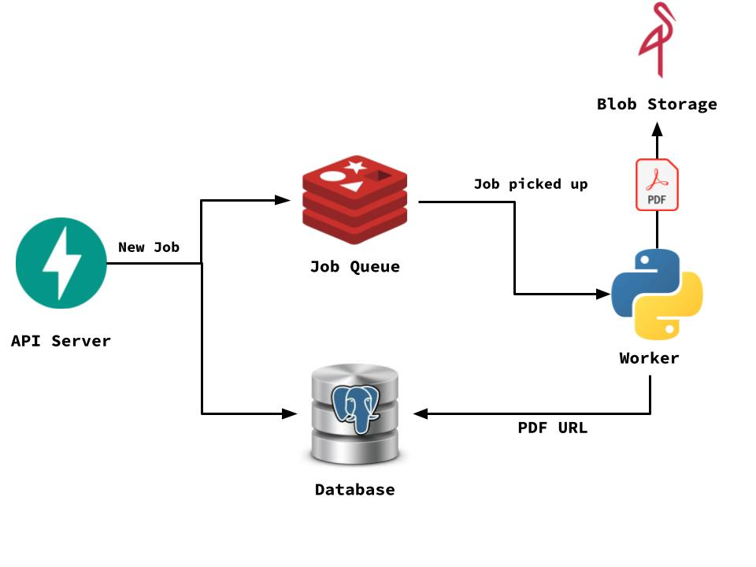

# [flyswatter](https://flyswatter-api.onrender.com/docs) [](https://github.com/felipevk/flyswatter/actions/workflows/makefile.yml) [](https://www.python.org) [](https://fastapi.tiangolo.com)
:bug:Issue Tracker API made with FastAPI and PostgreSQL.

## Features
- Bug Tracking
- User Creation and Login using JWT tokens
- API with CRUD operations such as <sub>/user/create</sub> <sub>/user/{user_id}</sub> <sub>/user/all</sub> <sub>/issue/edit/{issue_id}</sub>.
- Async Job System used to generate PDF reports
- All endpoints can be accessed at <sub>/docs</sub> using Swagger UI
- Errors logged in Sentry, metrics can be observed by Prometheus from <sub>/metrics</sub>
- Extensive suite of tests using pytest

## Setup
Create .env file following [.env.example](.env.example)
```
pip install --no-cache-dir poetry
poetry config virtualenvs.create false | poetry install --no-interaction --no-ansi
docker compose up --build -d
poetry run dotenv run -- python -m app.db.create_database
make demo
```

## Testing
Create .env.test following [.env.example](.env.example) and follow setup instructions.
```
make db-create-test
make test
```

## API Preview


## Job System
Flyswatter features an async background worker pool using Celery with Redis. It's used in the <sub>/user/report</sub> endpoint to request pdf reports for the current month.



Flyswatter enqueues jobs in a pool, which are then picked up by the worker service. 
- Jobs have retries with exponential backoff. 
- Failed jobs can be seen at the <sub>/jobs/failed</sub> endpoint.
- The results of a job can be seen at the <sub>/jobs/result</sub> endpoint.

## Tools
- Python
- Poetry
- FastAPI
- PostgreSQL 
- SQLAlchemy
- Alembic
- Docker + docker-compose
- pytest
- Sentry
- Prometheus
- Celery
- Redis
- MinIO
