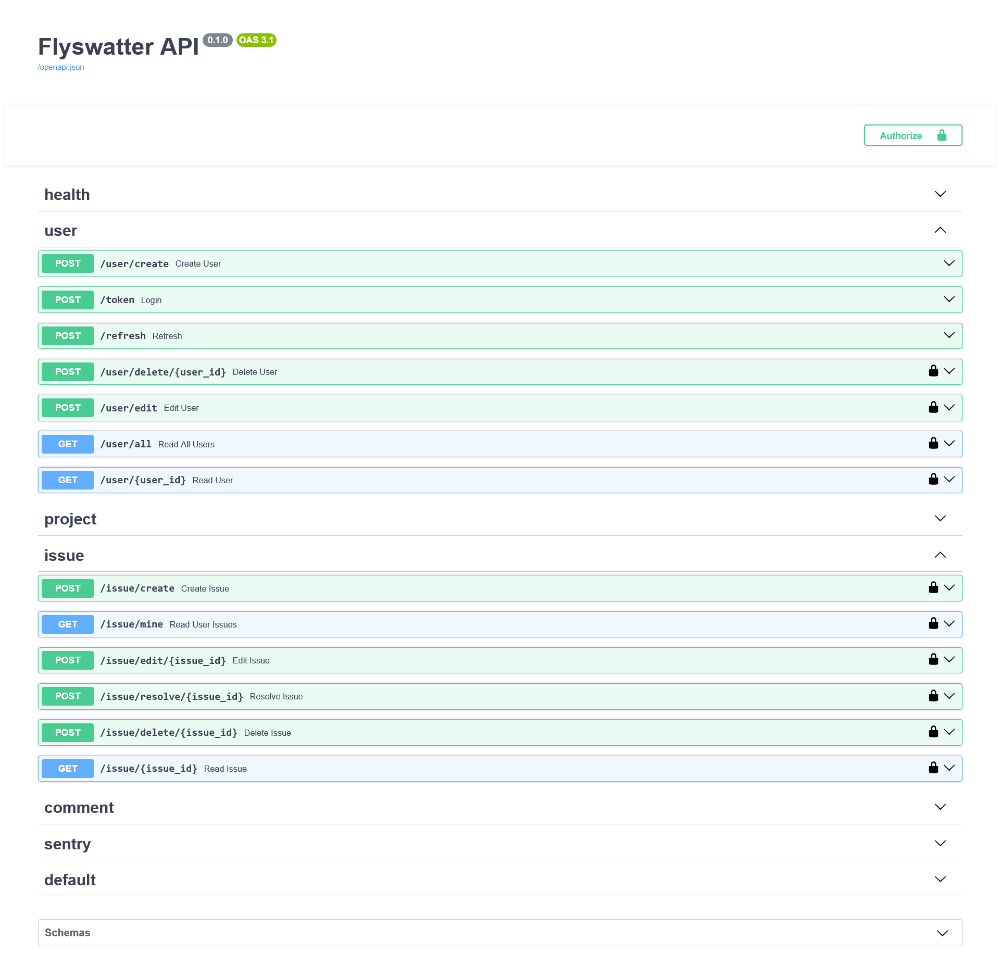

# flyswatter
:bug:Issue Tracker API made with FastAPI and PostgreSQL

## Features
- Bug Tracking
- User Creation and Login using JWT tokens
- API with CRUD operations such as <sub>/user/create</sub> <sub>/user/{user_id}</sub> <sub>/user/all</sub> <sub>/issue/edit/{issue_id}</sub>.
- All endpoints can be accessed at <sub>/docs</sub> using Swagger UI
- Errors logged in Sentry, metrics can be observed by Prometheus from <sub>/metrics</sub>

## Setup
Create .env file following [.env.example](.env.example)
```
pip install --no-cache-dir poetry
poetry config virtualenvs.create false | poetry install --no-interaction --no-ansi
poetry run dotenv run -- python -m app.db.create_database
docker compose up --build -d
make demo
```

## API Preview


## Tools
- Python
- Poetry
- FastAPI
- PostgreSQL 
- SQLAlchemy
- Alembic
- Docker + docker-compose
- pytest
- Sentry
- Prometheus
